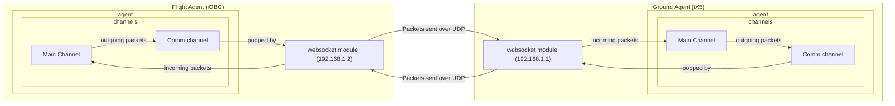

```mermaid

flowchart LR
    subgraph "Flight Agent (iOBC)"
        subgraph flight.agent["agent"]
            subgraph flight.channels["channels"]
                flight.main_channel["Main Channel"]
                flight.comm_channel["Comm channel"]
            end
        end
        flight.websocketmodule["websocket module  (192.168.1.2)"]

        %% Receive
        flight.websocketmodule -- incoming packets --> flight.main_channel
        %% Transmits
        flight.main_channel -- outgoing packets --> flight.comm_channel
        flight.comm_channel -- popped by --> flight.websocketmodule
    end
    subgraph "Ground Agent (iX5)"
        subgraph ground.agent["agent"]
            subgraph ground.channels["channels"]
                ground.main_channel["Main Channel"]
                ground.comm_channel["Comm channel"]
            end
        end
        ground.websocketmodule["websocket module (192.168.1.1)"]
        %% Receive
        ground.websocketmodule -- incoming packets --> ground.main_channel
        %% Transmits
        ground.main_channel -- outgoing packets --> ground.comm_channel
        ground.comm_channel -- popped by --> ground.websocketmodule
    end

    %% Connections
    %% Transfer
    ground.websocketmodule -- Packets sent over UDP --> flight.websocketmodule
    flight.websocketmodule -- Packets sent over UDP --> ground.websocketmodule


```
